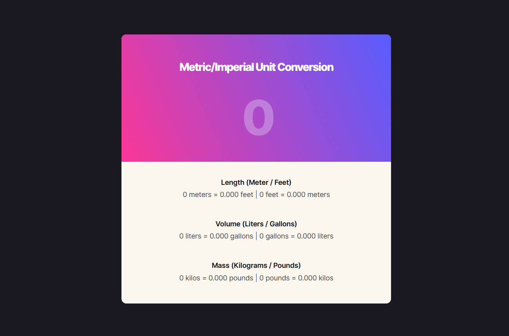

# Unit Converter

This is a simple unit converter web application built using HTML, CSS, and JavaScript. It allows users to convert between different units of measurement including meters to feet and vice versa, liters to gallons and vice versa, and kilograms to pounds and vice versa.

## Technologies Used

- HTML
- CSS
- JavaScript

## Features

- Convert between meters and feet
- Convert between liters and gallons
- Convert between kilograms and pounds

## Screenshots

## Live Demo

Check out the live demo [here](https://unit-converter-five-gamma.vercel.app/).
